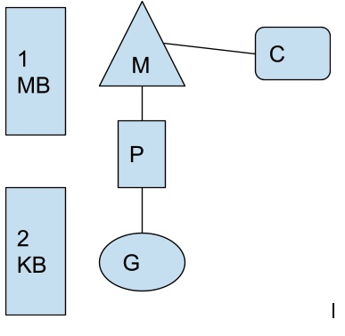

<!--- Headings --->
# Heading
## Heading
### Heading
#### Heading
##### Heading
###### Heading

<!--- Italics --->

*This Text* is Italic

_This Text_ is Italic

<!--- Strong --->

**This Text** is Strong

__This Text__ is Strong

<!--- Strikethrough --->

~~This Text~~ is strike through 

<!--- Horizontal Rule  --->

---

___

<!--- Blockquote --->

> This is a quote

<!--- links --->

[click](https://go/dev)

<!--- UL --->

* Item 1
* Item 2
    * Nexted 1
    * Nested 2
        * Nested1

<!--- OL --->

1. Item 1
1. Item 2
1. Item 3

<!--- Inline code --->

`var i=10;`

<!--- Images --->


<!--- Github Mark Down --->

<!--- Code Blocks --->

```bash
npm install
node index.js
```

```javascript
function add(num1, num2){
}
```

```python
def add(num1, num2):
    return 
```

```golang
func main() {
    fmt.Println("Hello")
}
```

<!---Tables --->

| Name          | Email             |
| ------------- | ----------------  |
| Name          | Email             |
| test asasas| test  |
| test | test  |

| S.no    | Name     | Email          |
| ------- | -------- | -------------- |
| 1 | Badhree | bj@sdff |
             


<!---Task List --->

* [X] Task 1
* [X] Task 2
* [ ] Task 3


