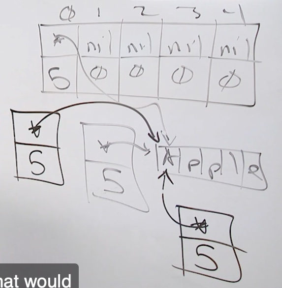
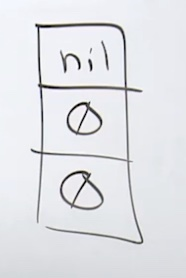
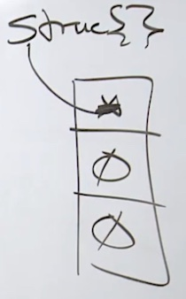
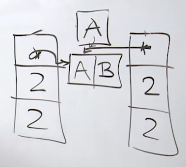

# Arrays

## Mechanical Sympathy


Cache Line

Cache Line should be already in L1 or L2 before we need it.

How can we create a situation the cache line can be inside L1 or L2

Write code with predictable access patterns to the memory to be mechanically sympathetic with the hardware

If you allocate a contiguous block of memory and walk through that memory on a predictable stride, the pre-fetchers can pick up on the data access

So we use an array  

Slice is really a vector 

TLB Cache - OS Manages 

Cache of OS page's virtual memory to Physical memory 

## Semantics

Arrays cant be variable size it must be fixed

```
    var fruits [5]string
```

`var fruits [5]string` in memory looks like 

| zero  | one  | two  | three  | four  | five  |
| ----- | ---- | ---- | ------ | ----- | ----- |
| nil | nil | nil | nil | nil | nil |
| empty | empty | empty | empty | empty | empty |

```
var fruits [5]string // This creates ampty array with nil values
fruits[0] = "Apple" // Assignment is a copy operation
```

`fruits[0] = "Apple"` creates a string which is a pointer to another string backed by a backing array

```
fruits - [*][*][*][*][*]
size   - [5][6][6][5][4]
          |
          |  
          |
          V  
          [*]
          [5]   
           |
           |
           V  
apple  -  [A][p][p][l][e] - Backing Array

```


fruits is a pointer to each words 
fruits gives us option to share or point to backing arrays like this:
0 points to  Starting position of `[A][p][p][l][e]`


for range is powerful- it has value semantics and pointer semantics

Value Semantics format of `for..range`
```
    var fruits [5]string // This creates ampty array with nil values
    	fruits[0] = "Apple" // Assignment is a copy operation
        .
        .
        .

	for i, fruit := range fruits {
		fmt.Println(i, fruit)

	}
```

Same backing array shared across 4 places
1. fruits array
2. fruits[0] copy operation
3. fruit that comes out of range function
4. fruit when passed as value semantics 



4 of them can be on the stack only the backing array needs to be in the heap, which means GC will be wfficient

# Slices 

Build in types 
User defined struct types 
Reference types - 
Slice,  maps,  channels,  interface, functions

They are DS that have a pointer

reference types zero vaue is 'nil'
Whereas zero value string is ''

Slice is 3 word or 24 byte DS

make is used when we already know how much is the size of slice 

length - total no of elements you can access from pointer position
capacity - total no of elements period existing in the backing array 
Capacity can be larger than length, but not the other way around.

Capacity is for growth 

`var data []string` this will create a zero value slice 



` data := []string{}` this will create a empty slice 



There is a zero allocation struct, which is basically a empty struct in go routines which all empty structs will point to

Append = Value Semantic Mutation API, which means it will get its own copy 

Append is going to ask one question
Is the length and capacity of the copy that it got is the same 
If its same, it will increase the size if backing array. If its null, it will create one. 



A memory leak in GO is when you allocate a value on Heap and it never goes away 
How to check if there is a memory leak ? DO a GC trace and see if memory is going up in every GC Run
Reasons:
Are we creating extra go routines, are they terminating or not 
Possible maps - we need to delete keys in maps based on time or event 
Or on an append call If its like this `data = append(bill, value)` this could cause a memory leak 

APIs that we supposed to close 

Until backing array goes to 1000 elements the capacity increases by 100 % after that it increases by 25%


## slice of a slice 

### with no capacity 

`slice2 := slice1[2:4]` 
What does this mean ?
Take elements starting at index 2 to index 3 --> (4-1) hence 2:4 

or it can be understood as 

Take the elements starting at index 2 to index 2 + ( length of the new slice ) 
In this case we need a length of 2 to we can add 2+2 = 4 hence 2:4

When we slice a slice like this, its basically sharing the same backing array 
So there will be problems when it mutates

`slice2[0] = "CHANGED"` this will also change slice1

`slice2 = append(slice2,"CHANGED")` - this will also change slice1

To avoid this we can slice a slice with capacity

### with capacity 

`slice2 := slice1[2:4:4]`
This means make a slice from index 2, with length of 2 (2+2=4) and capacity of 2 (2+2=4)
This syntax actually shares the same backing array until there is an append like
`slice2 = append(slice2,"CHANGED")`
When there is an append, it makes a copy of the elements that we are working with in a new backing array 

### copy function 

To avaoid any confusion we can just copy a slice to another slice `copy(slice3,slice1)`


