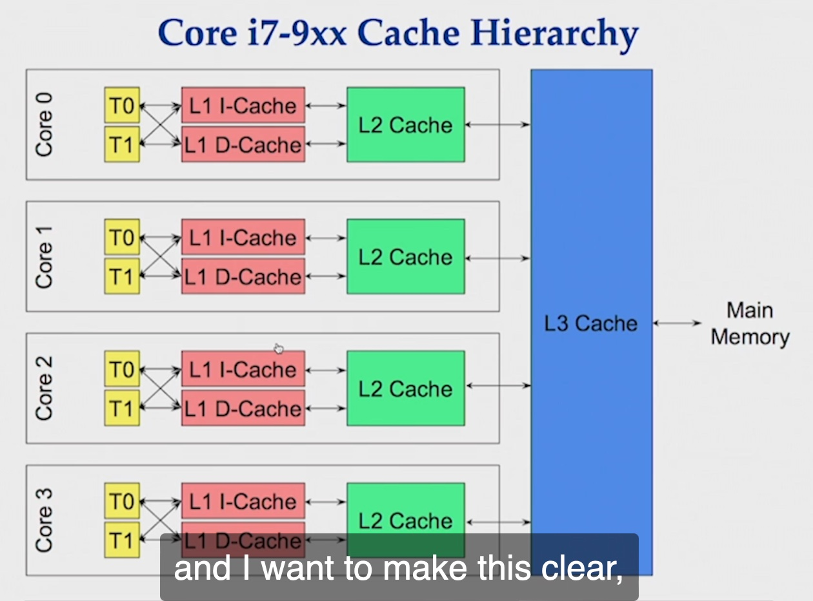

# Arrays

Cache Line

Cache Line should be already in L1 or L2 before we need it.

How can we create a situation the cache line can be inside L1 or L2

Write code with predictable access patterns to the memory to be mechanically sympathetic with the hardware

If you allocate contiguous block of memory and walk through that memory on a predictable stride, the pre-fetchers can pick up on the data access

So we use an array  

Slice is really a vector 

TLB Cache - OS Manages 

Cache of OS page's virtual memory to Physical memory 

