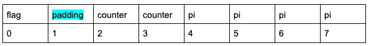
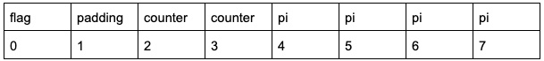
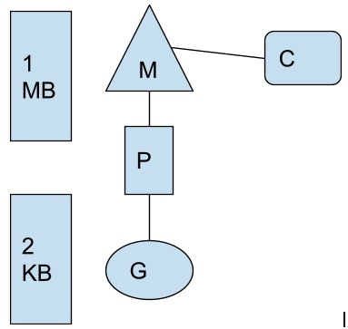
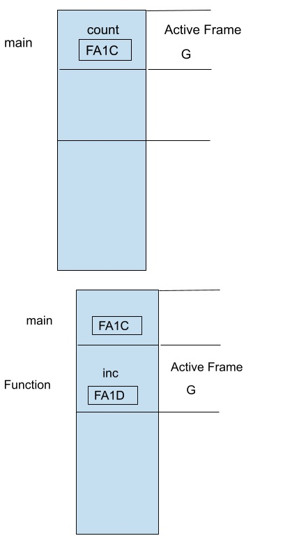
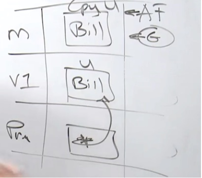
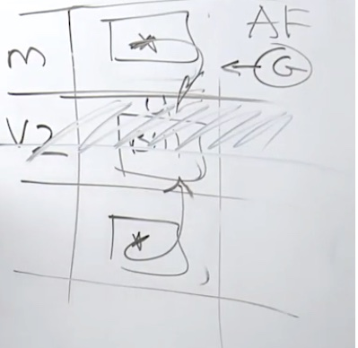
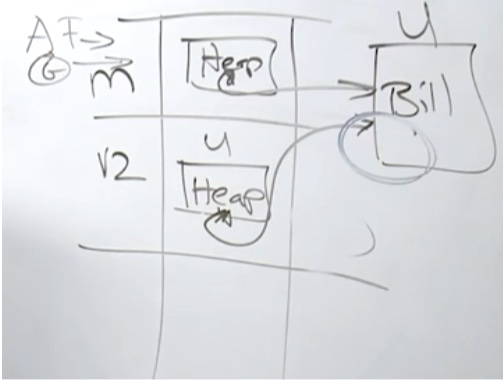
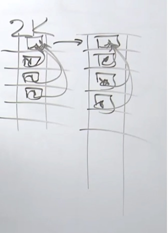
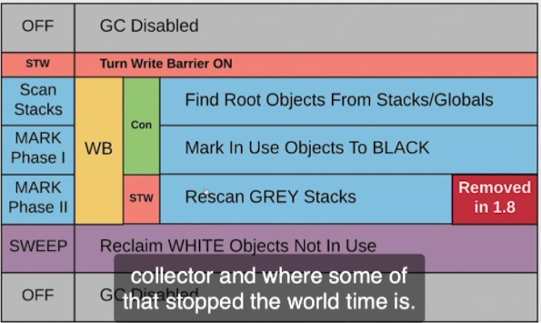

[Back](notes.md)

# Language Syntax

Var int -> Zero Value Initialization state - 00000000

Var string == 2 word .. nil + zero value

Aa := 1
Bb := “helo”

Bool - 1 byte
Int16 2 byte
Int  == int32 == 4 bytes
Float32 = 4 bytes 
Float64 = 8 bytes


## Padding 

```go
package main

type example struct {
	Flag bool
	Counter int16
	Pi float32
}
```



```go
package main

type example struct {
Counter int64
Pi float32
	Flag bool
}
```



## Named and Literal types

[Code](../conversion.go)

## How memory allocation is a performance problem

Everything in go is pass by value WYSIWYG

When go starts up it gets a logical processor (P)
P gets a OS thread M
M is scheduled by OS in a core C
Go Routine is where the Program will run (G) 




### Path of execution

#### Value Semantics (Pass By Value)

Data segments are Stacks and Heaps

OS Thread Stack -> 1 MB Of memory

Go Routine Stack ->  2 KB Of memory 



[code](../passbyvalue.go)

#### Pointer Semantics (Pass By Reference)

Address of counter var is passed to the function.

Function reads and mutates value in the given address which is outside its active frame
This can cause lot of problems but can be efficient
Its inc *int .. and not just inc * because the function still needs to know the type


pointer variables like  inc *int  are there to store addresses 

Memory below the active frame is of no value. Or zero value. It can be reused

[code](../passbypointers.go)

#### Escape Analysis

Go takes cognitive load off of us in terms of managing pointer semantics and mem management

Value Semantics 



Pointer Semantics 

Issue is  Stack Memory that V2 uses is gone so the user cannot be created in the stack

How does the call stack work ?



This is incorrect because if the call stack gets busy it could delete the data

Data actually gets created in HEAP



### Stack Growth

Call Stack for a go routine is 2K .. what if stack gets full?
Go creates another stack with current stack + 25% of size and copy all the contents to new stack



Stack Memory is to point to local routine .. escape analysis takes any thing that is shared among routines and places it in the heap 

Garbage Collector

Tri Color Mark and sweep Concurrent collector
Pacing algorithm 
Tries to balance 3 things
How do I get to the Smallest Heap Size, where the GC can run at a reasonable pace to do that, where the stop the world latency is never more than 100 microseconds per run

GC is allowed to take 25% of CPU 

GOGC default =100 which means 100% of heap will be increased 



### Constants

Constanta of Kind and Constants of Type


